# 🏕️ Camp-Travel — End-to-End DevOps Deployment of a Full-Stack Travel Application  

*(A Flask + React Application Deployed on AWS with EKS, Terraform, Jenkins, SonarQube, Trivy, ECR & Prometheus/Grafana)*  

---

## 📖 Overview  

**Camp-Travel** is a **full-stack travel booking and exploration web application** consisting of:  
- **Frontend:** React (Vite)  
- **Backend:** Flask (Python)  

The entire application is **containerized**, pushed to **Amazon ECR**, deployed on **EKS (Kubernetes)** using **Terraform**, and continuously integrated/delivered via **Jenkins**.  
This project demonstrates **complete CI/CD automation** with **quality analysis (SonarQube)**, **security scanning (Trivy)**, and **monitoring (Prometheus + Grafana)** — all running on AWS.  

---

## 🧱 Architecture  

Developer → GitHub → Jenkins → SonarQube → Trivy → AWS ECR → EKS → Prometheus → Grafana
   |
Terraform (Infrastructure as Code)

**Features**

Modern React frontend and Flask REST API backend

Containerized using Docker

CI/CD Pipeline via Jenkins

Static Code Analysis with SonarQube

Vulnerability Scanning with Trivy

Automated Deployment to AWS EKS

Infrastructure as Code using Terraform

Monitoring via Prometheus and Grafana

## 🏕️ Camp-Travel Homepage
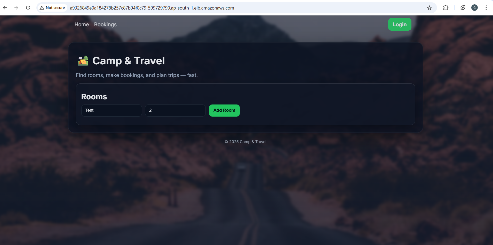

## 🔐 Login Page
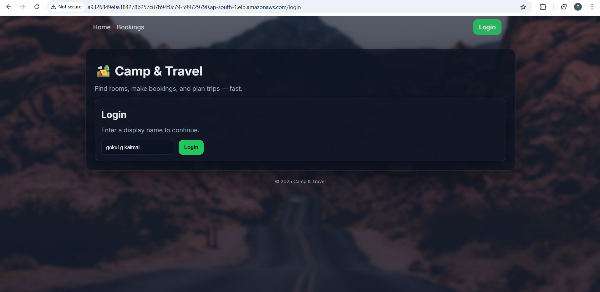

☁️ **DevOps & Deployment*

Tools & Services Used

Docker

Jenkins (CI/CD)

Terraform (IaC)

AWS EKS (Elastic Kubernetes Service)

AWS ECR (Container Registry)

SonarQube (Code Quality)

Trivy (Image Scan)

Prometheus + Grafana (Monitoring)

**Infrastructure & Installation (AWS + K8s + DevOps Tools)**
1️⃣ AWS Setup

Created a custom VPC using Terraform with 2–3 public subnets across AZs.

Provisioned:

EKS Cluster with managed node group (m7i-flex.large Instance)

ECR Repositories: camp-travel-frontend, camp-travel-backend

EC2 Tools Instance (m7i-flex.large Instance) for Jenkins, SonarQube, Trivy, Prometheus, Grafana

### 🧩 Terraform Apply Output
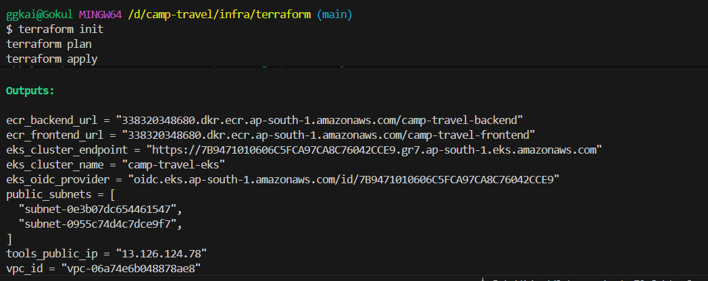

### ☁️ AWS EKS Cluster (camp-travel-eks)
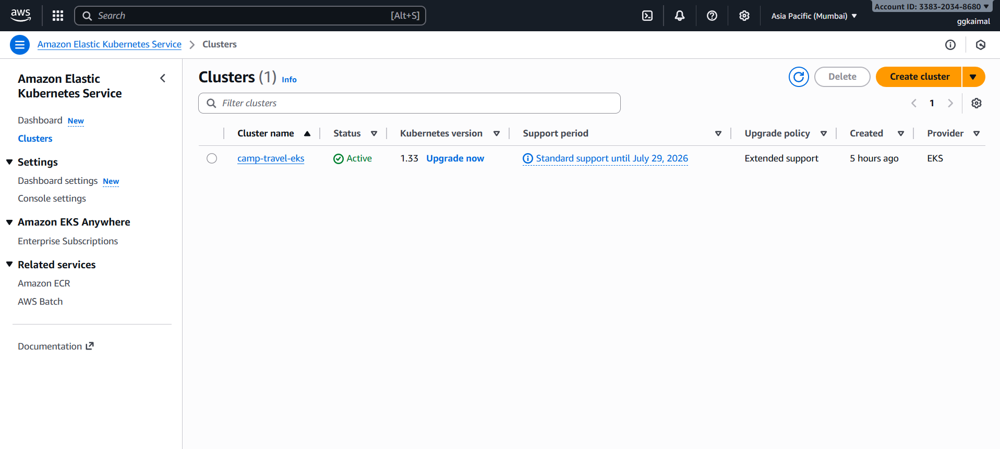

### 🐳 Docker Tools Setup
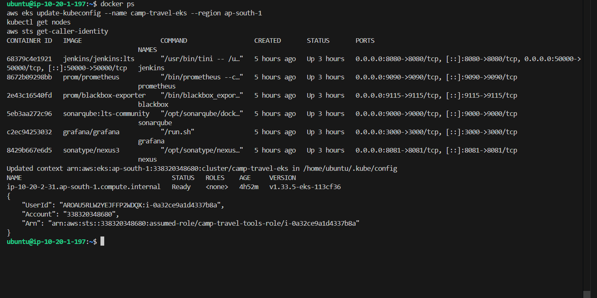

### 💻 EC2 (camp-travel-tools-instance)
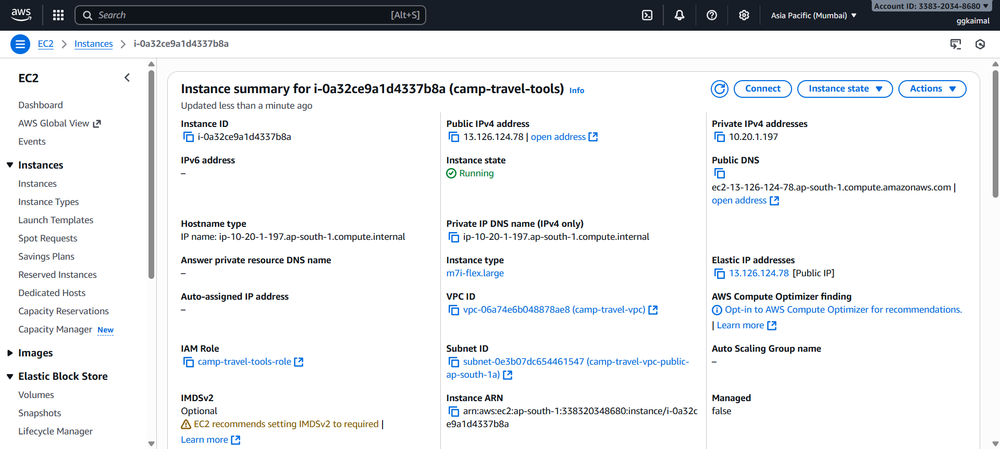

### 🧱 EKS Node Group
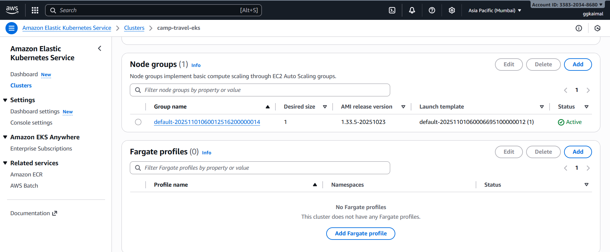

### 🪣 AWS ECR Repositories 
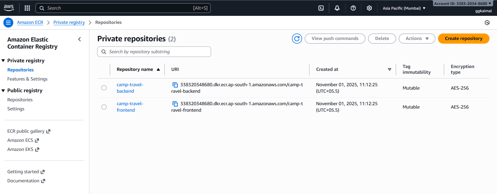

### ⚙️ Kubernetes Service (camp-travel)
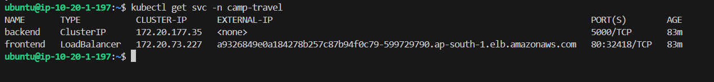

2️⃣ Jenkins CI/CD Pipeline Setup
Installed Tools on EC2

Docker

Jenkins

Trivy

kubectl

aws-cli

Configured Plugins

✅ Docker
✅ Pipeline
✅ SonarQube Scanner
✅ Kubernetes CLI
✅ Prometheus Metrics

Pipeline Stages
Stage	Description
1. Checkout	Pulls code from GitHub
2. Build/Test	React build & Flask unit tests
3. SonarQube Analysis	Static code quality check
4. Trivy Scan	Security vulnerability scan
5. Docker Build & Push	Builds & tags images → pushes to ECR
6. Deploy to EKS	kubectl apply for manifests
7. Smoke Test	Validates app health via Ingress URL

   ### 🧩 SonarQube Analysis
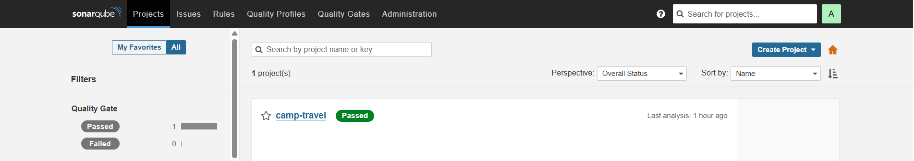

### 🚀 Jenkins Stages
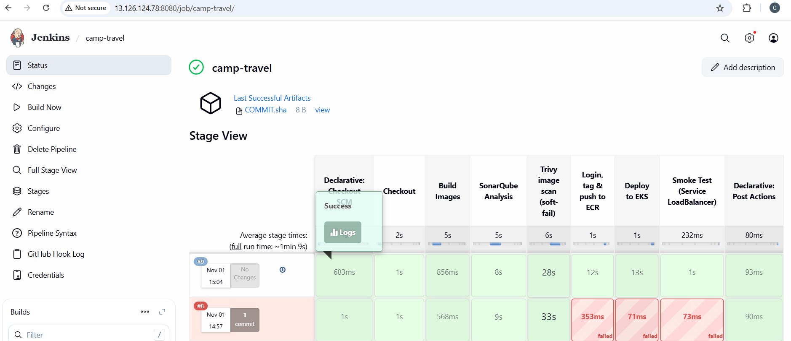

**Monitoring Setup (Prometheus + Grafana)**

Prometheus scrapes Jenkins /prometheus and Blackbox endpoints

Grafana dashboards:

Node Exporter (1860)

Blackbox Exporter (7587)

### 📊 Jenkins Metrics in Grafana
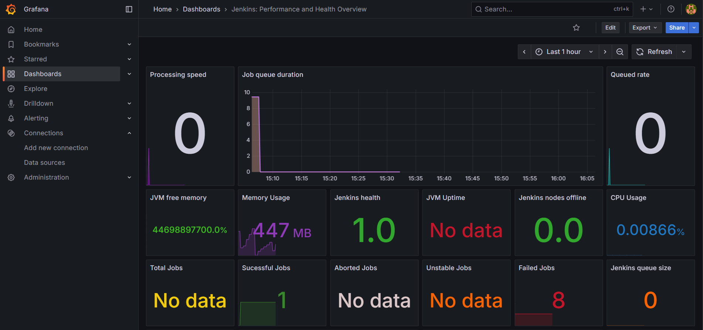

### 📈 Prometheus Data Source (Grafana)
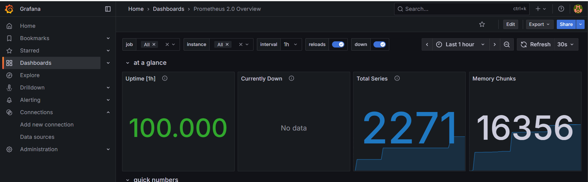

### 🧠 Prometheus Main Dashboard
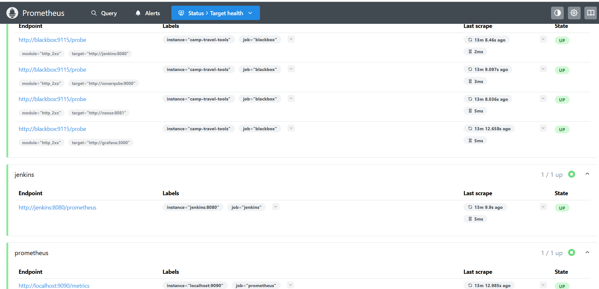

### 🕵️ Blackbox in Grafana
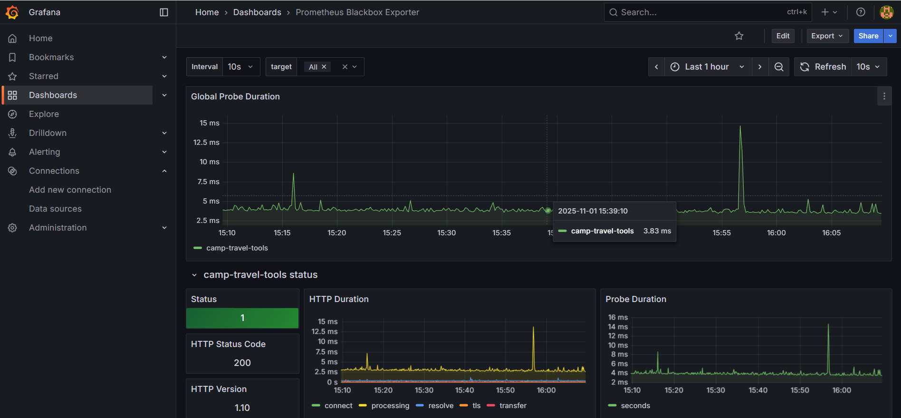

### ⚙️ Blackbox Exporter
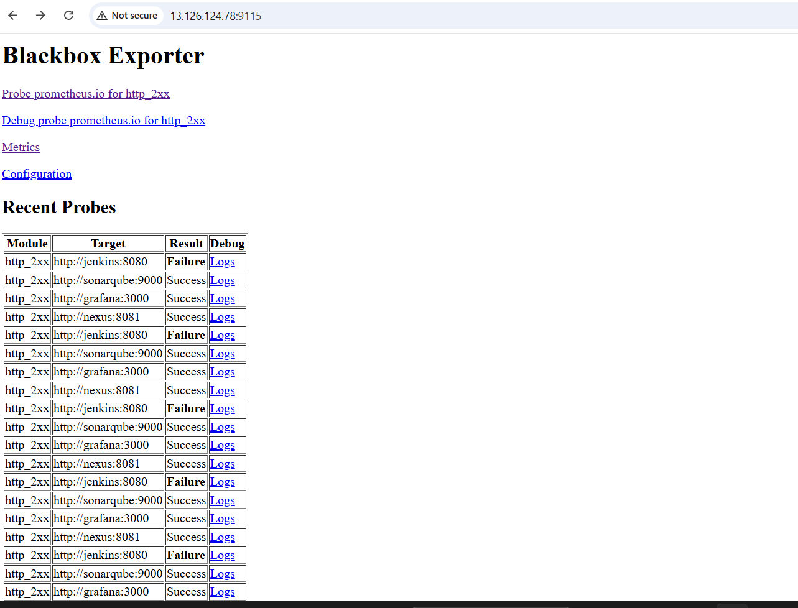

🧩 **Final Architecture**
Terraform (Infrastructure as Code)-->Developer → GitHub → Jenkins → SonarQube → Trivy → AWS ECR → EKS → Travel App → Prometheus → Grafana 

### 🧱 Jenkins Pipeline Overview
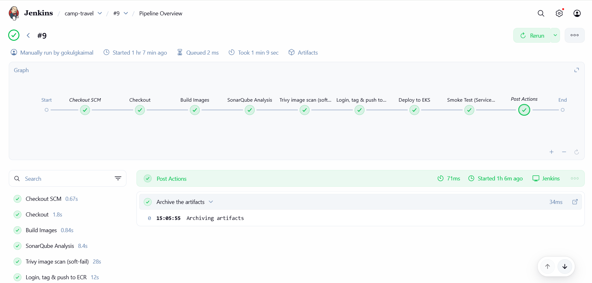

**Final Outcome**

✔️ Fully automated CI/CD pipeline with quality & security checks
✔️ Zero manual deployments — fully managed through Jenkins
✔️ Flask + React app deployed on AWS EKS
✔️ Live metrics and uptime monitoring via Grafana
✔️ End-to-end setup completed individually by a DevOps Engineer

## 🏕️ Camp-Travel Homepage

**Learnings**

Mastered AWS infrastructure automation using Terraform

Integrated code quality and vulnerability scans into CI/CD

Automated multi-service deployment to Kubernetes

Implemented continuous monitoring with Prometheus and Grafana

Built and deployed a full-stack application independently end-to-end

**👨‍💻 Author**

Gokul G Kaimal — DevOps Engineer

Built, automated, and deployed this full-scale Travel Application independently.

   

